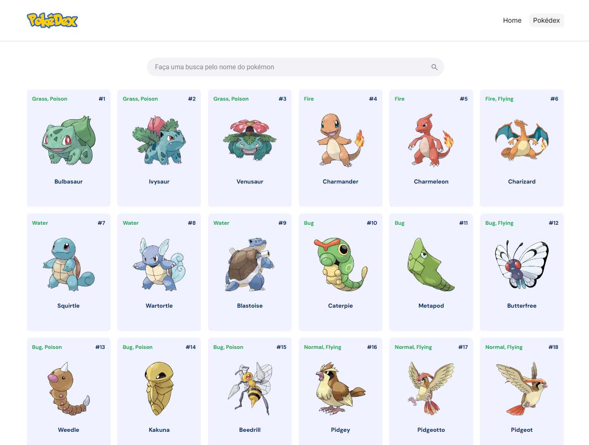

# 🔴 Pokédex

## 📝 Descrição

Este projeto para **aplicação Pokédex** desenvolvida puramente no Front-end, utilizando HTML, CSS e JavaScript puro. O objetivo principal foi recriar um design minimalista e moderno de uma lista de Pokémons, com foco em:

- **Funcionalidades:** Implementação da barra de pesquisa, renderização dos pokémons vindos da API e sistema de paginação visualmente coerentes.
- **Design Responsivo:** Layout de grade adaptável.
- **Microinterações:** Efeitos de `hover` nos botões e ícones.

## 💻 Como visualizar o projeto

Você pode baixar o projeto ou clonar em sua máquina e usar a extensão do VS Code chamada [Live Server](https://marketplace.visualstudio.com/items?itemName=ritwickdey.LiveServer). Execute a extensão e automaticamente você será levado para a página do projeto.

Também é possível ver o projeto online através deste link: [https://aldiransantos-pokedex.vercel.app/](https://aldiransantos-pokedex.vercel.app/)

## 🎯 Objetivo

Criar uma Pokedex interativa com base no design fornecido no Figma. A aplicação deve listar Pokémon, permitir busca, aplicar filtros e ter paginação. A implementação deve ser feita usando Vanilla JS. Caso prefira, você pode usar outras ferramentas ou bibliotecas, mas precisa justificar a escolha.

## 📋 Requisitos:

1. **Listagem de Pokémon:** Exibir uma lista de Pokémon, com dados vindos de uma API pública como a PokéAPI.
2. **Busca:** Permitir que o usuário busque Pokémon por nome ou outros critérios, sem recarregar a página.
3. **Paginação:** Exibir Pokémon por páginas, com opções para navegar entre as páginas.

## 🔧 Requisitos Técnicos:

- Use Vanilla JavaScript. Caso queira usar alguma ferramenta extra, fique à vontade, mas justifique a escolha.
- A aplicação deve ser responsiva, funcionando bem em diferentes tamanhos de tela (mobile e desktop).
- Mantenha o código organizado e legível.

## ✅ Critérios de Avaliação:

1. **Funcionalidade:** As funcionalidades (busca, filtros, paginação, listagem) estão funcionando corretamente?
2. **Estrutura do Código:** O código é bem organizado e fácil de entender?
3. **Responsividade:** O layout funciona bem em diferentes dispositivos (desktop, tablet, mobile)?
4. **Interatividade:** A busca e a paginação funcionam sem precisar recarregar a página?
5. **Design:** O design segue o modelo do Figma e é agradável de usar?
6. **Uso de Ferramentas:** Se usou bibliotecas externas, a escolha foi adequada e bem aplicada?

## 🖼️ Preview do Layout

Mostra o design final implementado em tela grande (desktop).

## 🛠️ Tecnologias

- **HTML5** (Semântica)
- **CSS3** (Estilização e Responsividade)
  - Metodologia **BEM** (Block Element Modifier) para organização das classes.
  - **CSS Grid** para o layout da lista de Pokémons (6 colunas).
  - **Variáveis CSS** (`:root`) para cores e tipografia.
- **JavaScript ES6+** (Para lógica futura de busca e paginação).
- **SVG Inline** para controle de cor de ícones.
- **API Pokédex** (Previsão de uso)

## 📂 Estrutura do Projeto

Abaixo está a arquitetura do projeto, separada por responsabilidade.

    pokedex-explorer/
    ├── assets/
    │   ├── favicon/
    │   ├── images/      // Imagens dos Pokémons e logos
    ├── index.html       // Estrutura principal
    ├── style.css        // Estilização completa (BEM e Variáveis)
    └── script.js        // Lógica da aplicação

## 🚀 Possibilidade de melhorias

1.  **Criação da Home:** Oportunidade de criar uma explicação do que é a Pokédex e os detalhes que você encontrará ao acessar essa área.
2.  **Modal do pokémon:** Esta funcionalidade traria mais detalhes quando o treinador clicasse no card do respectivo pokémon e abriria uma modal trazendo mais detalhes do pokémon escolhido.
3.  **Tema escuro:** Faria a página se tornar adaptada à pessoas com sensibilidade a cores mais claras.
4.  **Animação de loading:** Uma gif de uma pokédex sendo carregada ou uma pokebola voando em um pokémon enquanto acontece o fetchting da API.

## 🤝 Autor

